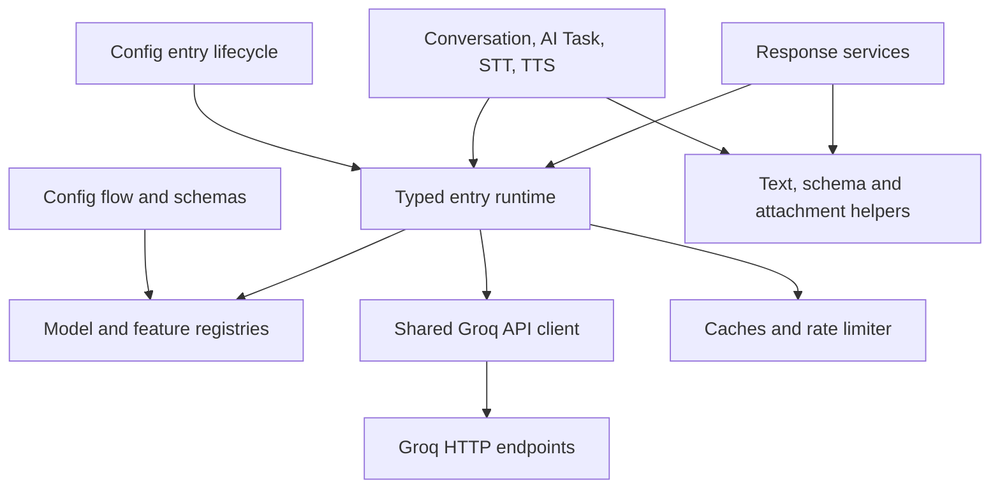

# Architectural review — 5 September 2026

Reviewed baseline: `8dca993` (integration 1.4.4). Scope: all 25 integration Python
modules, relevant tests, development harness, CI, metadata and architecture guidance.
This document preserves the original architectural assessment and assigned plan.
Source locations and baseline results below describe the code before implementation.
The recommendations have since been implemented and critically reviewed; see the
[implementation and validation record](architectural-improvements-2026-09-05.md).

## Conclusion

The integration has a sound Home Assistant architecture, but it cannot yet be
described as consistently reliable or fully aligned with best practice. Several
configuration and request-handling defects are hidden by extensive unit coverage.
Maintainability is reasonable at the component level and weaker inside the large
configuration, service and API modules. Performance safeguards exist, but unnecessary
attachment processing, incorrect context estimation and rate-limit handling need work.

Keep the existing architecture and address the bounded changes below. A rewrite,
mandatory coordinator, new background polling, or new external API library is not
justified by this review. The Platinum label is explicitly a self-assessment; passing
the repository evidence validator does not independently establish correctness or
Home Assistant approval.

## What is working well

- One typed `GroqConfigEntry` runtime owns its API client, capabilities, rate limiter,
  response cache and service configuration. Account/service subentries and stable
  device/entity identifiers are appropriate for this cloud service integration.
- Integration-level service registration occurs in `async_setup`; platform setup
  and unloading are awaited, and the entry update listener is unload-bound.
- Native conversation, AI Task, STT and TTS entities provide the expected HA surfaces.
  Requests are on demand; adding a polling coordinator would not improve this model.
- Network I/O uses asynchronous aiohttp sessions provided by HA, with request
  timeouts, disabled redirects, bounded response reads and explicit cancellation
  propagation. Audio processing uses asynchronous subprocesses and executor work.
- Capability checks, translated errors, reauthentication, diagnostics redaction,
  attachment access checks, bounded history and cache expiry already exist.
- CI includes pinned action revisions, a minimum-Core job, typing, import warnings,
  quality evidence and an unusually strong statement-coverage gate.
- Preserve the schema-type-aware OpenAPI compatibility fix from PR #47. Its
  Voluptuous/Probatio branches cover real supported upgrade combinations.

These strengths align with the current [HA quality rules](https://developers.home-assistant.io/docs/core/integration-quality-scale/rules/),
including runtime data, action setup, asynchronous dependencies and shared sessions.
They do not cancel out the behavioral findings below.

## Architecture and dependency boundaries

The intended separation is useful. Two boundaries need strengthening: AI Task
currently imports private conversation helpers, and `services.py` combines HA
target lookup, file/media authorization, payload assembly, validation, caching and
service descriptions. Extract only demonstrably shared policies, backed by behavior
tests. File length alone is not a reason to split modules.

## Prioritized change inventory

P1 means high-impact behavior to fix first. P2 means a concrete correctness or
reliability defect. P3 means maintainability or a performance/validation improvement
whose implementation should be guided by evidence. Detailed briefs contain source
locations, proposed fixes and acceptance tests.

| Priority | Finding and impact | Assigned owner / package |
| --- | --- | --- |
| P1 | Clearing the Assist API selection is removed during input cleaning; merging old settings can restore HA control after the user deselects it. | `lifecycle_review`, L1 |
| P2 | Saving an empty account API-key form overwrites existing options, potentially losing legacy credentials and TTS/service configuration. | `lifecycle_review`, L2 |
| P2 | `dict`-only checks reject HA immutable mappings: diagnostics misses configured features and the legacy unique-ID migration branch is skipped. Migration scheduling also needs verification. | `lifecycle_review`, L3 |
| P2 | Persistent model repair issues lack recovery/removal reconciliation; access issues collide between accounts using the same model. | `lifecycle_review`, L4; coordinate transport hooks |
| P2 | Runtime capability checks accept models explicitly marked inactive, although selectors exclude them. | `lifecycle_review`, L5 |
| P2 | Feature selectors replace a successful catalogue with built-ins when no matching model exists, disagreeing with the strict runtime registry. Absence is not proof of provider denial; the defect is inconsistent local policy. | `lifecycle_review`, L6 |
| P2 | Composite provider cooldowns are not parsed, and exhaustion of one quota uses the other quota's reset too, causing incorrect local blocking. | `transport_review`, rate-limit handling |
| P2 | Streaming HTTP errors require valid JSON before status classification; plain-text/HTML 429 or 503 responses lose the intended rate-limit or availability behavior. | `transport_review`, HTTP error handling |
| P1 | Every HTTP 403 triggers reauthentication, including documented organization/project model-permission failures that a replacement key may not resolve. | `transport_review`, permission classification; coordinate L4 |
| P2 | Provider error strings and dictionaries are passed through exceptions/logs without a bounded sanitization contract. Synthetic request content can be echoed; no real secret disclosure was observed. | `transport_review`, T4 |
| P2 | Prompt cache copies only outer dictionaries, so modifying nested data in an original response or cache hit modifies future cached results. | `transport_review`, T5 |
| P2 | Cancellation while executor-based temporary-directory creation is pending can leak its eventual directory; cancellation during writes can race cleanup. | `transport_review`, T6 |
| P2 | Local attachment/media paths use an unbounded read after a size check. A growing file can allocate beyond the limit; service readers also lack the attachment helper's post-read bound. | `transport_review`, T7; `generation_review`, G8 |
| P1 | Multimodal context estimation counts base64 image bytes as text tokens and can reject ordinary supported images before making a request. | `generation_review`, context estimation |
| P1 | A cache-enabled service enables the account feature; cache checks omit the selected service's opt-in, so cache-disabled sibling services can reuse responses. | `generation_review`, cache policy |
| P2 | Service schema defaults are injected into calls before configuration precedence is resolved, overriding configured `strict` and `schema_name` values when callers omit them. | `generation_review`, service defaults |
| P2 | Structured result validation varies across AI Task/service paths; configured schemas are not consistently enforced after generation or through fallback. | `generation_review`, structured output policy |
| P2 | Conversation history resolves attachments before trimming, so discarded old files can add work or fail a new request. The current attachment can be read again for duplicate detection. | `generation_review`, history construction |
| P2 | Malformed tool-argument JSON becomes an executable empty argument object; tools with defaults may run despite invalid model output. Non-object JSON also needs rejection. | `generation_review`, G6 |
| P2 | Reasoning capability checks combine raw call/configuration values differently from request construction, rejecting valid explicit false overrides. | `generation_review`, G7 |
| P2 | Tests exercise real HA imports but predominantly substitute runtime objects and flow methods. They miss mapping, registration, lifecycle and option-precedence contracts despite 100% statement coverage. | `lifecycle_review`, validation brief |
| P2 | Main test image/plugin remain on Core 2026.7.2. The minimum job does not establish current-Core behavior; an image override can be silently downgraded by the pytest helper dependency. | `lifecycle_review`, validation brief |
| P3 | AI Task no-tool paths bypass prepared ChatLog context and do not append final assistant content consistently with tool paths. This is context/trace consistency, not a claim of a broken public continuation API. | `generation_review`, ChatLog consistency |
| P2/P3 | Cache entry-count limits are not total byte budgets: 256 accepted 25 MiB audio items permit a formal 6.25 GiB per-service ceiling. Add byte limits; separately measure concurrent duplicate-call costs. This is a bound, not observed consumption. | `transport_review`, T8 and optional deduplication |
| P3 | TTS speed accepts NaN and sample-rate coercion truncates fractional numbers; reject invalid numeric values before quota accounting/network calls. | `transport_review`, T9 |
| P3 | Availability logging promises HA will retry arbitrary failed runtime calls, although no such retry is scheduled. Correct the message without replaying generative/tool requests. | `transport_review`, T10 |
| P3 | Private cross-platform helpers, duplicated request/validation policies and test-only compatibility helpers increase regression risk. Consolidate them after correctness fixes. | All three owners, optional cleanup sections |
| P3 | Broad missing-import typing overrides leave HA API compatibility less checked than local function typing suggests. Add real contract tests and investigate scoped typed boundaries. | `lifecycle_review`, validation brief |
| P3 | Architecture notes describe an obsolete TTS expansion proposal, and README's claim that local tests use the minimum version is inaccurate. | `lifecycle_review`, validation/documentation brief |

Groq documents model-specific permission errors separately from invalid credentials
in its [model permission documentation](https://console.groq.com/docs/model-permissions).
Cooldown parsing must follow its [rate-limit headers](https://console.groq.com/docs/rate-limits).

## Redundant code and maintainability

Remove verified production-unreferenced helpers such as
`__init__._has_other_loaded_entries` and the obsolete configuration model-fetch/
selector wrappers; remove their obsolete tests at the same time. Inline wrappers
that only copy a dictionary and discard an argument. Confirm references before
deleting exports or compatibility aliases.

Centralize effective configuration precedence, request options and schema/result
validation. Put shared ChatLog/tool conversion in a common module instead of
importing private helpers from another platform. Consolidate HTTP status handling
without erasing the different JSON, SSE and audio success paths. Consider extracting
authorized media resolution from the service module when its duplicated readers
are addressed.

Modernize synthetic fixtures before deleting `hasattr`/`getattr` fallbacks. Some
fallbacks only accommodate incomplete test doubles; others preserve real supported
versions or legacy entries. Keep those categories explicit. Break new tests into
behavior-focused modules rather than extending the 4,228-line coverage-gap file.

## Verification performed

The worktree was clean at the start. No live Groq credentials, live HA controls,
remote writes, commits or pushes were used.

| Check | Result |
| --- | --- |
| `scripts/test python -m pytest -q` | 322 passed in 1.82 seconds |
| `scripts/test python -m pytest --cov=custom_components.groq --cov-report=term-missing --cov-fail-under=100 -q` | 322 passed in 4.25 seconds; all 25 modules at 100% statement coverage, 4,298 statements |
| Actual imported runtime | Home Assistant 2026.7.2; Python 3.14.6 |
| `scripts/strict-typing` | Pass; 25 source files |
| `scripts/test python scripts/validate_quality_scale.py` | Pass; evidence-file validation only |
| `scripts/test python scripts/importtime_profile.py --strict-integration-warnings --output /tmp/groq-architecture-importtime.log` | Pass; 25-module cold import measured 1,863 ms in this container |

The import measurement includes dependency initialization. It is not a measurement
of incremental HA startup cost or request latency, and one sample is not a benchmark.
An external `rich` SyntaxWarning appeared during pytest; it did not fail the suite.

Focused non-network reproductions additionally showed:

- Immutable subentry data produced `enabled_features=[]` for a configured text service.
- Immutable legacy data caused no migration update call.
- Cleaning an explicitly empty Assist selection removed the submitted key.
- Parsing `2m59.56s` returned `None`.
- Exhausted tokens with a one-second reset plus healthy requests with a one-hour
  reset resulted in a 3,600-second local block.
- The generation reviewer reproduced a 400 KiB inline image estimated at roughly
  136,573 text tokens, exceeding a 131,072-token context window.
- The transport reviewer reproduced nested prompt-cache corruption and a leaked
  temporary directory when cancellation occurred during executor creation. These
  were isolated reproductions of the checked-in code, not live HA incidents.

HA's [coverage rule](https://developers.home-assistant.io/docs/core/integration-quality-scale/rules/test-coverage/)
sets a coverage floor, but the [testing guidance](https://developers.home-assistant.io/docs/development_testing/)
is also needed to verify observable integration behavior. Retain the repository's
100% gate while adding real HA lifecycle/flow/registry/service tests. This review
does not establish current-Core runtime compatibility, provider throughput, live
voice latency or memory under sustained load.

## Subagent assignments and implementation sequence

The following briefs have been assigned to and prepared by the named subagents:

1. [`lifecycle_review`: configuration, lifecycle, models and repairs](review-assignments/lifecycle.md).
2. [`transport_review`: HTTP, cooldowns, audio and resources](review-assignments/transport.md).
3. [`generation_review`: services, AI Task, Assist, schemas and caching](review-assignments/generation.md).
4. [`lifecycle_review`: validation, CI compatibility and documentation](review-assignments/validation.md),
   as a separate bounded follow-up assignment.

Implement L1 and L2 first. Add realistic HA fixtures alongside the fixes they prove.
Then proceed in independent configuration, transport and generation change sets.
Agree on repair ownership/callbacks before transport and lifecycle changes touch the
same API. Agree on cache policy inputs before cache mechanics and service policy
changes overlap. Use separate regression-test files per workstream.

Follow correctness changes with the identified refactors and measured resource
improvements. Update architecture and quality evidence to match the final code.
Each implementation package needs its specified acceptance tests; the complete
repository verification set remains mandatory before any future push. The review
does not authorize dropping coverage gates or removing supported compatibility paths.
