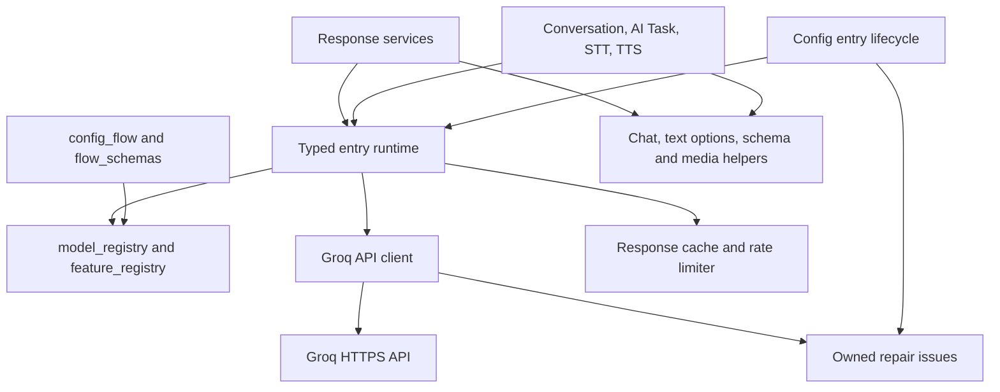

# Groq integration architecture

The integration exposes Groq cloud capabilities through Home Assistant config
entries, service subentries, native voice/AI platforms and response actions. It
makes requests on demand; it has no periodic polling coordinator.

## Account, service and runtime ownership

One config entry stores account credentials and an API base URL. Users add
service subentries for text generation, speech-to-text, text-to-speech or image
recognition. A text-generation subentry supplies both a conversation entity for
Assist and an AI Task entity. Image recognition/OCR uses response actions.

`types.GroqConfigEntry` binds the entry to `runtime.GroqRuntimeData`. That runtime
owns one shared `GroqApiClient`, model/feature registries, cooldown tracking,
response cache and indexed service configuration. Services select their target by
subentry identity; account actions select the config entry. Entity/device IDs are
stable and associated with the matching HA config subentry.

Account option values override entry data. Service settings override account
settings, and explicitly supplied action fields override service defaults. An
explicit false or empty selection is different from an omitted field. Clearing
Assist's selected API disables that control capability while preserving hidden
advanced settings. A blank account API-key submission preserves effective
credentials and unrelated options.

Legacy account-level TTS settings remain supported. Entry minor version 2 migrates
legacy stable identifiers using HA's immutable data mapping contract, without
changing an existing identifier or trying to downgrade a newer schema version.

## Module boundaries



| Module | Responsibility |
| --- | --- |
| `__init__.py` | Integration services, entry setup, platform forwarding, reload, unload and migration |
| `config_flow.py`, `flow_schemas.py` | Account/subentry forms, input preservation and model-aware validation |
| `const.py`, `subentries.py` | Shared constants, value precedence and service identity extraction |
| `runtime.py`, `types.py` | Typed entry runtime and shared object construction |
| `model_registry.py`, `feature_registry.py` | Model activity/capabilities and enabled HA platforms/actions |
| `api.py` | Async HTTP, payload models, response normalization and speech request ownership |
| `rate_limit.py`, `prompt_cache.py` | Provider cooldowns and bounded local response storage |
| `conversation.py`, `ai_task.py` | HA platform entrypoints and platform-specific result handling |
| `chat.py` | Shared ChatLog, attachment/history and tool-call adaptation |
| `text_generation.py`, `structured.py` | Effective generation options, request checks and local schema validation |
| `services.py` | Authorized action target resolution, response actions and dynamic descriptions |
| `attachments.py` | Authorized bounded media reads and attachment conversion |
| `stt.py`, `tts.py`, `audio_files.py` | Speech platforms and cancellation-safe bounded ffmpeg I/O/files |
| `entity.py`, `diagnostics.py`, `repairs.py` | Device identity, redacted diagnostics and recoverable owned issues |

## Lifecycle

`async_setup` registers integration-level response actions once. Entry setup creates
runtime objects, validates credentials/connectivity by discovering models, then
forwards only the platforms required by configured services. An account without
services creates no service entities. Authentication failure raises the HA auth
exception; temporary setup connectivity failure raises `ConfigEntryNotReady`.

An unload-bound entry update listener reloads changed configuration. Unload first
unloads the platforms, then drains owned speech tasks and refreshes service target
descriptions. Shared HA aiohttp sessions belong to HA and are never closed by this
integration. Account removal and service changes reconcile owned repair issues.

Successful discovery is authoritative for the local catalogue: inactive models and
features with no matching models are not offered as if discovery failed. Built-in
metadata remains the fallback when discovery is unavailable. Catalogue visibility
does not prove permission to execute a model; inference access is checked by actual
requests.

## Generation and tool execution

Assist and AI Task consume HA ChatLog through the shared adapter. History is
trimmed before loading attachments, keeping complete tool exchanges, and converted
attachments are reused within one turn. Tool argument JSON must be an object and
call IDs must be valid before dispatch through HA's LLM API. Invalid arguments are
not silently turned into a default operation. Tool iterations remain capped.

No-tool AI Task calls also use the prepared HA context and record final assistant
content. Task-provided structure takes precedence over a configured service schema.
Native structured output, tool-assisted generation and JSON fallback share local
schema validation before a result is returned or cached. The validator does not
fetch remote schema references.

Request options and capability checks use the same resolved precedence. Context
estimation considers text, tools and schemas without treating base64 image bytes
as text tokens. It is a heuristic; provider context enforcement remains authoritative.
Image count and byte limits apply independently.

Keep the schema-type-aware Probatio/Voluptuous OpenAPI adapter while the supported
HA range needs both. Package availability alone is insufficient in mixed upgrade
environments.

## Network failures and repairs

The shared client uses HA's aiohttp session, bounded response reads, explicit
request/stream timeouts and disabled redirect following. JSON, SSE and binary-audio
paths share HTTP error classification while retaining their different successful
response formats. Non-JSON HTTP failures still preserve rate-limit and availability
behavior; invalid stream content becomes a controlled integration error.

HTTP 401 initiates reauthentication. Documented organization/project model
permission errors use a scoped model-access issue instead of account reauth.
Unexpected 403 responses follow the client's explicit authentication fallback.
Only bounded classification metadata is retained in API errors; arbitrary provider
messages or payloads are not copied into routine logs.

Repairs carry account/service/model ownership. Success clears the matching access
issue, and changing/removing configuration clears obsolete issues without clearing
another account's active failure. Listing models alone does not clear inference
permission failures. Availability logging describes recovery on the next request;
it does not promise replay of arbitrary failed generation/tool operations.

## Resource and cancellation limits

Local response caching is opt-in for each eligible service. An explicit service
opt-out wins over another service enabling the feature. Cached JSON is serialized
so a caller cannot mutate a future response through nested dictionaries or lists.
TTL expiry occurs before capacity eviction. Item limits are supplemented by a
16 MiB budget for serialized responses and keys per account runtime. This bounds
stored content; it is not a precise limit on Python object/process memory.

Speech caching preserves per-service namespaces and item settings, with a 64 MiB
account-wide budget for audio and keys. Oversized items are returned without being
cached. Identical concurrent speech requests share a bounded owned task; cancellation
of one waiter leaves another waiter intact, while the last cancellation or entry
unload cancels and drains the work. Unrelated speech requests may run concurrently,
up to eight owned synthesis tasks.

Provider rate headers support numeric and composite durations. The local guard
uses exhausted quota windows rather than unrelated healthy windows. The existing
TTS free-tier counter is conservative per-service accounting, not authoritative
organization-wide usage: request text is estimated locally and transport retries
are not individually charged by that counter.

Disk reads request at most the allowed byte limit plus one overflow byte. Permission
and HA path-allowlist checks remain in place. File work and image encoding use the
executor. Temporary ffmpeg files have one owner through creation, writing and
cleanup, including cancellation while executor work is still running. Process I/O
bounds audio output to 64 MiB and retained stderr to 64 KiB while draining pipes;
cancellation and timeout kill/reap the process.

STT still packages permitted input as WAV in memory. Small voice clips make this
cheap; measurements for large inputs and cache limits are recorded separately from
claims about actual device or provider performance.

## Validation and performance evidence

The primary Docker harness runs HA 2026.9.0 with pytest helper 0.13.363; the minimum
harness runs HA 2026.6.0 with helper 0.13.336. Image digests are pinned. Both verify
the original image's Core version after dependency installation and check package
consistency. An incompatible `HA_IMAGE` override fails instead of silently testing
a downgraded Core. `scripts/test --minimum` selects the separate minimum container.

Tests combine pure unit cases with real HA config entries, immutable subentries,
flow managers, entity/issue registries, service dispatch and ChatLog. Outbound Groq
I/O and external process boundaries are mocked. Every integration module and each
changed module must retain 100% statement coverage. Branch coverage is additional
evidence for error/cancellation paths, not a replacement for behavior tests.

Strict typing locates the exact installed HA source and checks the integration
against its real interfaces. Imported dependency internals are not themselves
checked as this integration's code. A separate positive/negative control confirms
that immutable data mutation and invalid callbacks/content are rejected.

To measure local runtime overhead independently of network latency:

```bash
scripts/test python -m pytest scripts/benchmark_runtime.py -q -s
scripts/test python scripts/importtime_profile.py --preload-home-assistant --runs 3
scripts/test python scripts/benchmark_tts_rate_limit.py
```

The runtime benchmark reports warmed setup, uncached service-dispatch latency and
maximum event-loop tick interval using real HA with deterministic fake provider I/O.
No absolute benchmark threshold is enforced across different hardware. Cold import
cost includes dependency initialization and is reported separately. The quality
label remains a repository self-assessment, not official Home Assistant approval.
